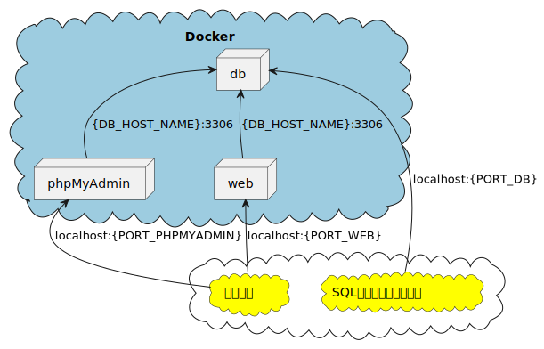

# Laravel9環境

Laravel9 のGitHubテンプレートリポジトリです。

## インストール

- Git (GitHub)
- Docker Desktop
- ターミナル (Windowsの場合、「PowerShell」, 「GitBash」等)
- VSCode (任意)
- SQLクライアント (任意 「A5:SQL Mk-2」、「DBeaver」等)

## テンプレート導入

導入は、ダウンロードするか、テンプレートからリポジトリを作成してください。

### ダウンロードする場合

「Code」から「Download ZIP」を選択するとダウンロードが可能です。

### リポジトリを作成する場合

#### リポジトリ作成

「Use this template」ボタンで、テンプレートから自身のリポジトリを作成してください。

- テンプレートからリポジトリを作成する
  - <https://docs.github.com/ja/repositories/creating-and-managing-repositories/creating-a-repository-from-a-template>

#### clone

自身で作成したリポジトリをcloneしてください。

- リポジトリをクローンする
  - <https://docs.github.com/ja/repositories/creating-and-managing-repositories/cloning-a-repository>

## 開発環境

Dockerを使って環境を構築します。  

### 構成図



### 構築する環境

- Webコンテナ
  - [php:8.1.14-apache](https://hub.docker.com/_/php)
  - [composer:2.5.1](https://hub.docker.com/_/composer)
- DBコンテナ
  - [mysql:8.0.31](https://hub.docker.com/_/mysql)
- phpMyAdminコンテナ
  - [phpmyadmin:5.2.0](https://hub.docker.com/_/phpmyadmin)

### .env

[.env](./.env)ファイルはDockerの環境ファイルです。  
各名称・ポート設定をしてください。  
基本的にはそのまま使用可能ですが、IPとポートが重複するとコンテナが起動しないので  
自身の環境に合わせて設定を変えてください。

### compose

以下のコマンドを実行します。

```bash
# ターミナルで実行
## ls コマンドで docker-compose.yml があるか確認
ls docker-compose.yml
## docker-compose で環境構築  ※ 時間がかかるので注意
docker-compose up -d
```

上記コマンドでエラーがなければ環境構築が完了しています。

### Laravel

Laravel関連のコマンドはDockerで用意した、WEBサーバー（コンテナ）上で行います。

```bash
# ターミナルで実行
## WEBサーバーに入るコマンド（-itの後に入る名称はコンテナ名「{NAME_PREFIX}-web」）
docker exec -it laravel9-web bash
```

VSCodeの[Docker拡張機能](https://marketplace.visualstudio.com/items?itemName=ms-azuretools.vscode-docker)が入っている場合、対象コンテナの「Attach Shell」でも開けます。  

#### composer install

```bash
# ■ WEBサーバーで入力
# 「composer.json」、「composer.lock」に記載されているパッケージをvendorディレクトリにインストール
#   ※ 時間がかかるので注意。
composer install
```

`composer install` 実行後に「`Exception`」が出ていると失敗しているので  
[root/vendor/](./root/vendor/)ディレクトリを削除して、再実行してみましょう。  
「`successfully`」が出ていれば成功です。

#### Laravel初期設定

```bash
# ■ WEBサーバーで入力
cd /var/www/root
# 「.env」ファイル
## 「.env.dev」ファイルを「.env」にコピー
cp .env.dev .env
# storage ディレクトリに読み取り・書き込み権限を与える（bootstrap, storage内に書き込み（ログ出力時等）に「Permission denied」のエラーが発生する）
chmod -R 777 bootstrap/cache/
chmod -R 777 storage/
```

### 確認

- WEB ※ **IP・ポート番号は [`.env`](./.env) の `IP`・`PORT_WEB` を参照**
  - <http://127.0.0.1:81/>   
    [routes/web.php](./root/routes/web.php)のURI「`'/'`」の実行結果が画面に表示されます。  
    VSCodeの[Docker拡張機能](https://marketplace.visualstudio.com/items?itemName=ms-azuretools.vscode-docker)が入っている場合、対象コンテナの「Open in Browser」でも開けます。  
- phpMyAdmin ※ **IP・ポート番号は [`.env`](./.env) の `IP`・`PORT_PHPMYADMIN` を参照**
  - <http://127.0.0.1:8081>
    VSCodeの[Docker拡張機能](https://marketplace.visualstudio.com/items?itemName=ms-azuretools.vscode-docker)が入っている場合、対象コンテナの「Open in Browser」でも開けます。  

### Laravel設定

#### 言語ファイルダウンロード

※ **以下は導入済みです**  

「[`resources/lang/`](./root/resources/lang/)」に「`ja`」ディレクトリが生成され4つの言語ファイルが追加されます。  
※ 2022/07 現在、Laravel8向けの言語ファイルしか用意されていません。  
　Laravel8の言語ファイルを使う場合、Laravel9と言語ファイルの格納場所が異なるためご注意ください。  

| Laravel | 言語ディレクトリパス |
| --- | --- |
| Laravel8 | root/resources/lang/ja |
| Laravel9 | root/lang/ja |

```bash
# ■ WEBサーバーで入力
cd /var/www/root
php -r "copy('https://readouble.com/laravel/8.x/ja/install-ja-lang-files.php', 'install-ja-lang.php');"
php -f install-ja-lang.php
php -r "unlink('install-ja-lang.php');"

# Laravel9の場合、lang/ja に移動
mv resources/lang/ja/ lang/
rmdir resources/lang/
```

- auth.php言語ファイル <https://readouble.com/laravel/8.x/ja/auth-php.html>
- pagination.php言語ファイル <https://readouble.com/laravel/8.x/ja/pagination-php.html>
- passwords.php言語ファイル <https://readouble.com/laravel/8.x/ja/passwords-php.html>
- validation.php言語ファイル <https://readouble.com/laravel/8.x/ja/validation-php.html>

#### app.php

※ **以下は導入済みです**  

`config/app.php` の日本設定を行います。

| Key | Value | 備考 |
| --- | :---: | --- |
| timezone | `Asia/Tokyo` | デフォルト: `UTC` |
| locale  | `ja` | デフォルト: `en` |
| fallback_locale | `en` | デフォルト: `en`<br>locale の言語が見つからない場合に適用する言語<br>デフォルトの`en`を指定するのが良い |
| faker_locale | `ja_JP` | デフォルト: `en_US` |

#### .env.testing設定

※ **以下は導入済みです（migrationは必要）**  

Laravel UnitTest用の設定を行います。  
[.env.testing](./root/.env.testing)ファイルを作成し、DB_*にテスト用データベース（laravel_test）を設定します。  
UnitTest実行時に.envファイルの代わりに使われるためAPP_KEYなどの設定も必要です。  

テスト用データベースにmigrationを適用には、以下のコマンドを実行します。  

```sh
php artisan migrate --env=testing
```

- `Laravel 9.x テスト: テストの準備`
  - <https://readouble.com/laravel/9.x/ja/testing.html>

#### Laravel Debugbar

※ **以下は導入済みです**  

Laravelで作成した画面の下にデバッグバーが表示され、様々な情報が見れるようになります。

- GitHub
  - <https://github.com/barryvdh/laravel-debugbar>
  - Release
    - <https://github.com/barryvdh/laravel-debugbar/releases>

```bash
# ■ WEBサーバーで入力
cd /var/www/root
# composer.json にパッケージを追加し、インストールする。 「--dev」をつけることで開発環境のみに適用。
composer require --dev barryvdh/laravel-debugbar
# config/debugbar.php を追加。
php artisan vendor:publish --provider="Barryvdh\Debugbar\ServiceProvider"
```

# プロジェクト概要
| 項目      | 内容                                                             |
| ------- | -------------------------------------------------------------- |
| プロジェクト名 | 企業向け資産管理システム開発                                                 |
| 期間      | 約 1 年 2 ヶ月                                     |
| チーム規模   | 5名（PM 1名、設計者 1名、開発 3名）                                         |
| 開発環境    | Laravel 9 / PHP 8.1 / MySQL / Git / Docker / Tailwind / Blade |
| 担当範囲    | 詳細設計、画面設計書修正、DB設計、実装、結合テスト                                     |

# システム概要
社内のIT資産（PC、モニタ、ライセンス、モバイル端末など）を一元管理し、
棚卸、貸出/返却、メンテナンス履歴、保証期限などを管理できるWebシステム。

# 担当業務の詳細
① 画面設計・詳細設計
ユーザー管理、資産登録、貸出・返却画面など10画面超の設計

Figma/Excel形式の画面設計書修正および作成

入力制御やバリデーション仕様の定義

操作フロー（モーダル、検索フィルター、ページネーション設計）

② DB設計（テーブル設計）
15以上のテーブル設計（資産、カテゴリ、ユーザー、貸出履歴、棚卸など）

ER図作成、正規化、マイグレーションファイル作成

Eloquentのリレーション（hasMany、belongsToなど）設計

③ プログラム実装（Laravel）
認証（Laravel Breeze）によるログイン/ログアウト処理実装

Bladeテンプレートによる動的UI構築（条件表示、ループ、パーシャル化）

CRUD処理の実装（資産登録、更新、削除、貸出など）

サービスクラス、リポジトリパターンを用いたビジネスロジック分離

④ 結合テスト
Excel形式のテストケース表に基づく結合テストの実施

Laravel Feature Test（PHPUnit）による自動化テスト一部導入

テスト結果の記録、不具合修正および再テスト

⑤ その他
Gitによるブランチ管理、Pull Requestベースの開発フロー

レビュー対応、定例ミーティング参加、進捗報告

# 使用技術
| 種類      | 内容                                      |
| ------- | --------------------------------------- |
| 言語      | PHP 8.1 / JavaScript                    |
| フレームワーク | Laravel 9 / Laravel Breeze              |
| フロントエンド | Blade / Bootstrap 5                     |
| DB      | MySQL 8                                 |
| 開発環境    | Docker / VSCode          |
| 管理ツール   | GitHub / Excel                |
| テスト     | PHPUnit（Laravel Feature Test）、手動テスト（結合） |


アカウント
test@mail.com
test123456